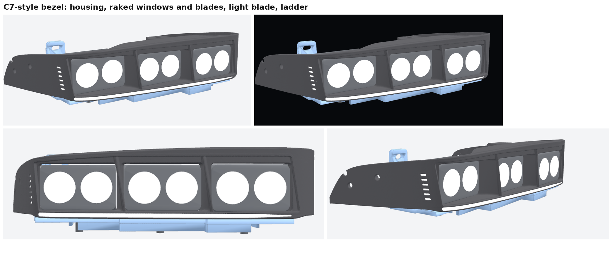
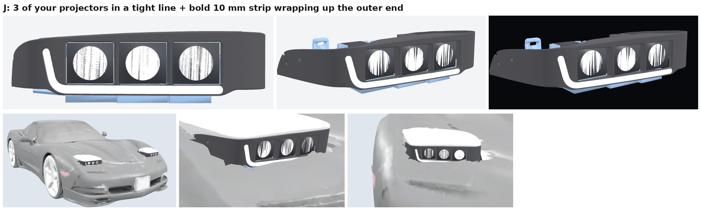
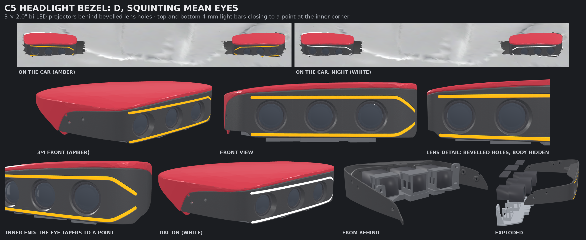
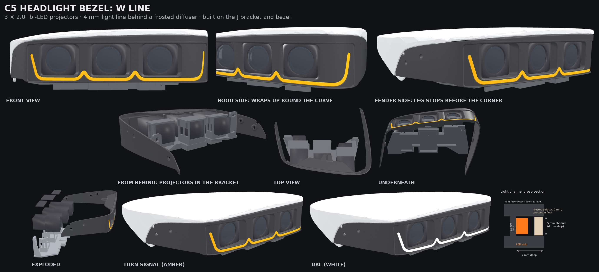

# C5 sleepy-eye pod carrier and bezel (v10: C7 look; v11: projector version)

For a 2000 C5 Corvette with the headlight door stops already fitted, holding three
3.0 × 1.8 in dual-lens LED pods per side. Like the KnightDriveTV kit, each side is one
carrier that bolts to the stock headlight mounting points (the fender-side arm and the
hood-side aiming pad), plus a one-piece bezel: a thin shell that wraps round the lights
and screws to the headlight door's side flanges where the stock bezel does. The geometry is an original design; see `../notes/c5-sleepy-eye-video.md` for the install video notes it follows.

Assembly diagrams: `diagrams/exploded.png`, `diagrams/front.png`, `diagrams/rear.png`, `diagrams/side.png`.
Step size options (6, 9, 12 and 15 mm) side by side: `diagrams/step_options.png`.
What to measure on the stock bezel and headlight: `diagrams/measure_stock_bezel.png`.
How the pods sit on the bracket (carrier), with the bezel hidden: `diagrams/pods_on_bracket.png`.
The bezel on its own, in matte black: `diagrams/shell.png`. How each ear fits the imprint the stock
ear leaves on the door: `diagrams/ear_imprint.png` and `diagrams/ears_on_door.png`. On the door from six sides: `diagrams/on_door.png`.
The bezel against the owner's model of the headlight doors: `diagrams/cover_fit.png`, and
rendered with the door on: `diagrams/with_door.png`.

## The C7 look (v10)

Before and after, from the same angles: `preview/bezel_old_vs_c7.png`.

The bezel's face is restyled after the C7 Corvette's headlamp. GM describes it as a black
housing round the projectors, a thin white "daytime styling blade" underneath that follows the
body lines, and a ladder of small LEDs up the outboard edge (white, amber as the turn
signal). Here:

- **Housing:** the three pods sit in one recessed tray, 3 mm back from the face, with crisp
  edges and ends that lean back 10 degrees. Print the bezel in black and paint the tray
  satin or matte black (and the face gloss) to get the darker housing.
- **Raked windows and blades:** each window leans back 10 degrees (tops toward the fender),
  and the posts between them are thin tapered blades, 1.6 mm at the front edge.
- **Light blade:** a 3 mm slot under all three pods, tapering to a point at the hood (inboard)
  end, with a 4.2 × 1.5 mm frosted diffuser behind it and an open-backed channel for a
  4 mm COB LED strip. The bezel's bottom edge comes down 2.6 mm (to z = 0.4) to carry it.
- **Ladder:** six short raked rungs just past the housing at the fender (outboard) end, all
  lit from one pocket behind them: a 9 × 32 mm diffuser and a 25 mm piece of 8 mm COB strip
  standing upright (white, or a white/amber switchback strip if you wire it as a turn signal).
- Everything else is unchanged: the pods, their spacing and lenses, the top rail, bead and
  clip tongue, the ears and screws, and the fit to the opening.

Behind each slot there's a ledge for the diffuser and an open back, so the strip goes in
from behind and its wires run back with the pods' wiring. The diffusers print in natural
(clear) PCTG or PETG: `stl/drl_diffusers_*.stl`.

Room for the lights is tight, measured from the model: there are 7.5 mm between the
bracket's floor and the bottom of the pods, so the light blade's channel fits between them
with about 0.5 mm to spare each way. The fender pod's outer corner is only about 3 mm behind
the face, which is why the ladder stands just past the housing rather than inside it. To
fit the light blade, the bracket's pod pockets are now **open at the front**
(`pocket_front_open`): their front walls sat right where the channel runs. The stud slots
were already the forward stop, so nothing changes in use.

The other looks from the design brief (A: a light blade along the top; B: cut-corner pod
frames with an L-shaped light at each end; C: tray, fins and a lower bar; BC: B's frames with
a lower bar under each pod) are still there: set `BEZEL_STYLE` and rerun `bezel_sdf.py`.
`preview/bezel_concepts.png` compares them, and `BEZEL_STYLE=plain` gives the v9 bezel.

## Projector version (v11): J, three bi-LED projectors and a thin light line

`stl/projectors_P3J/`: for the owner's mini 2.0 in bi-LED projectors (from the eBay listing: heads
55 wide x 48 tall x 50 deep, and a 41 mm square fan body 44 deep behind, 94 mm in all; the
threaded mounting stem on the back is a separate bracket held by 4 screws, and comes off) and a
thin switchback strip (white DRL, amber turn signal). (`stl/projectors_P3C/` is a C7-styled
alternative: the same heads in a recessed housing with raked windows and fins, and a 10 mm strip.)

**D (`stl/projectors_P3D/`), the owner's "dual straight DRL" concept.** The same projectors and
bracket, with two light bars, one above the projectors and one below, shaped as squinting, mean eyes
(`D_SQUINT`, `D_SQUINT_LOW`): both run level across the projectors (the top one as low as the
rail at the fender end allows, so the dark band above it grows heavier toward the hood), then,
past the hood-side projector, the top one angles down 35 degrees and the bottom one up 30, so
the eye tapers to its inner corner. Both stop before the tight fender corner. The bezel's
face covers each head, with a round hole for its lens (`LENS_D` 42 mm, plus a 2 mm gap round it:
measure the real lens and set it). To fit a bar between the heads and the rail, the heads sit
3 mm lower than J's (z 3.6 to 51.6, `D_LIFT`), and the bezel's bottom edge comes down to -5.7 for
the lower bar. Both bars are 4 mm strips in 5 mm channels behind a frosted diffuser (`LINE4`).
How far the lens stands proud of the face depends on how far it stands out from the projector's
face; each head's front is 1.8 mm behind the face (a 1.5 mm skin covers it).

**W (`stl/projectors_P3V/`), the owner's concept sheet.** The same heads, bracket, eyelid recess
and pockets as J, with smaller side bevels (5 mm, so the posts between the pockets are wider), and
a 4 mm light line (`LINE4`: a 5 mm channel, 7 mm deep, with a 2 mm frosted diffuser pressed in
flush, `drl_diffusers_*.stl`) in a W: it runs under the pockets, humps up between them round
their rounded bottom corners (1.2 mm of plastic all the way round), leaves the outer pocket's
corner in a diagonal leg that stops before the tight fender corner (`V_LEG`), and at the hood
end sweeps up round the curved corner (`V_HOOD`).

**Look.** Three projectors in a line, spread as far apart as the car allows, standing forward of
the bezel: each head comes up to 0.5 mm behind the bezel's original face line (at its tightest
edge), and the light face round them is recessed 5 mm under the top rail (`EYELID_J`), so the
heads stand out of it (up to 4.5 mm; less on each head's hood side, as the face curves in plan
and the heads are flat). Nothing goes past the original face line: it sits at the door's
outline, and the whole assembly swings down into the body when the lights close. Each head
stands in its own opening with an even gap round it (2 mm each side, 0.75 mm top and bottom,
`J_LIP`), the same as its clearance behind, so a little misalignment between the bezel (on the
door) and the bracket (on the arm) can't make them rub. The light line (8 mm, behind a frosted
diffuser) is one swoosh, as the owner sketched it: it starts on the fender-side side panel,
curls down and forward in an S, wraps round the fender corner low, runs under the projectors and
rises toward the hood end, ending a third of the way up (`P3J_END` "swoosh", `SW_SIDE`,
`SW_HOOD`). On the side it starts as high and as far back as it can: from there back, the door's
side flange sits about 4 mm behind the panel, and the line's channel is 9.5 mm deep. It steps out
of the recess onto the corner just past the fender-side opening. `P3J_END` picks the other
shapes that were tried.

**Finish.** Satin black is the easy finish: it hides layer lines. Gloss black looks best but
shows every flaw: sand, filler-primer, sand again (repeat until smooth), then gloss paint or
clear. The side ears' screw holes stay where the door's stock flange holes are (there's as
little as 2 mm of plastic there, too thin to recess a screw head); use black screws.

**Bezel.** The same top rail, bead, clip tongue, ears and fit to the door as the C7 bezel. (W
keeps J's earlier pockets, a little smaller than the head's face so the bezel frames it.) Behind
each head's front the bezel keeps 2 mm clear of it side to side and 0.75 mm up and down. The
heads only just fit under the door: at the
fender end there's about 1 mm between the head and the rail, which is why they sit 2.9 mm higher
than the pods did (the line runs under them). The print split runs through the post between the
first two heads, with the dowel pin in a small boss (J: half way up the post, behind the recess;
W: under the post).

**Light line.** A channel 8 mm wide and 8 mm deep, closed behind by a 1.5 mm wall tied into the
bezel's floor; the bezel's bottom edge comes down 3.7 mm below the bracket's floor to carry it,
with a 1 mm lip under the recess. A frosted diffuser (`drl_diffusers_*.stl`, one piece the line's
whole length, 2.5 mm thick) presses in from the front, 0.3 mm behind the recess's floor. The strip
sits behind it, up to 5 mm thick: a white/amber switchback strip 5-8 mm wide (a flat COB strip, or
a side-bend neon for the curves). The diffuser evens the line out and hides any joins, so the
strip can be cut into pieces at the curves. Print the diffuser in natural (clear) PCTG or PETG,
100% infill; it's meant to be frosted. The strip's wires go out through a hole at the hood end,
low down, and back in a groove under the bezel's floor to the bracket.

**Bracket** (`carrier_*.stl`). The same mounting tabs, slots, knees and gussets as the pod
bracket, so it bolts to the arm and the aiming pad the same way, and the stock adjusters aim all
three projectors together. Under each projector a cradle holds the body from below and both
sides (4 mm walls, with windows for the fan's air), and a strap (`projector_straps_*.stl`) screws
down across the top with M4 self-tapping screws (two each side, or one where the cradle is
short). Put a strip of foam tape on the saddle. The cradles stop 1 mm in front of the mounting
tabs' plane (the arm and the pad are behind it), and short of the flange nuts on the arm bolts
and the pad's square aim adjuster. Placement: the fender-side head is 8 mm in from the pod's
place so its body clears the arm's mounting tab, the hood-side one 9.5 mm in so its body clears
the adjuster, and the middle one halfway.

**Wiring.** A raised pad with two M3 holes, 24 mm apart, under the middle head, for a connector
block or the DRL/switchback module, and pairs of zip-tie slots under the other heads and by the
hood end, where the strip's wires come back. Each projector needs power, ground and a high-beam
wire; run them back with the strip's wires to the headlight harness through a relay, and fuse it.

**Still to check on the car:** what's behind the mounting tabs (their back face, against the arm
and the pad). Take the projectors' mounting stems off (4 screws on the back of each; keep the
screws in the fan's holes). Then the bodies end (hood side first) 23 and 13 mm in front of it and
3 mm behind (W); J's heads are 3.5 mm further forward, so its bodies end 26.5, 16.5 and 0.5 mm
in front of it. Leave a few mm of air behind each fan. On J, also cycle the lights slowly by hand
and check the projectors' fronts clear the body as the lights go down: they stay behind the
bezel's original face line, but stand further forward than before.

**Print:** the bracket stands on the back of its mounting tabs, like the pod bracket (turn it
45 degrees on the bed); the straps print flat. Use ASA if you can, or PCTG: the projectors get
warm.

Build: `BEZEL_STYLE=P3J python3 bezel_sdf.py`, then `LIGHTS=projectors BEZEL_STYLE=P3J python3
generate.py`; check with `LIGHTS=projectors BEZEL_STYLE=P3J python3 check.py`.

## Measurements used

Taken with a tape on the car. The owner says they're approximate, so every mounting hole
is a short slot, sized snug (6.3 mm) on an M6 bolt so the bolt stays put while you line up.

| | Measurement | Value | Adjustment built in |
|---|---|---|---|
| A | Fender arm, hole 1 to hole 4 | 1.7 in (43.2 mm) | — |
| H | Aiming pad, upper hole to lower hole | 0.8 in measured; 19.0 mm after the test tab showed it a bit wide | — |
| B | Across the car, pad upper hole to arm hole 4 | 8.75 in (222.3 mm) | arm slots ±3.7 mm side to side |
| D | Pad upper hole above arm hole 4 | 0.76 in (19.3 mm) | pad slots ±1.8 mm up and down |
| C | Pad face vs arm face, front to back | unknown | printed spacer washers, 2 / 4 / 6 mm |
| F | Front opening width | 11 in (279.4 mm) | bezel is 269.4 mm, 5 mm clear each side |
| — | Bezel windows | pod face + 2.0 mm left/right and + 1.6 mm top/bottom, centred 0.3 in up for the bracket lift | matches the 1-notch test frame, which fit on the car |
| — | Pods | 3.0 × 1.8 in face, 1.8 in deep, 2.1 in tall with the bracket (maker's drawing) | pod slots: 16 mm forward, 10 mm back |
| — | Pod stud | about 8 mm (5/16 in), in 8.6 mm floor slots | — |
| — | Mounting bolts | M6 × 1.0, 10 mm flange nuts | — |

**Still estimated:**
- How far back the mounting wall sits behind the pod faces (95 mm).
- The pod height relative to the holes (arm hole 4 is 14 mm above the carrier floor).
- The bezel's outside shape and where its top sits against the cover: see "The bezel"
  below. `diagrams/measure_stock_bezel.png` shows the seven numbers that pin these down
  (S1 to S5 on the stock bezel, V and D on the stock headlight with the bezel screwed back on).

The long pod slots and the bezel's slotted tabs take up the fore-aft part of that.

## The curve

Like the KnightDriveTV Gen 2 bracket, the pods follow the curve of the headlight opening
with a staircase, not by turning. All three face straight ahead, and each pocket sits a
little further back than the one beside it:

| Pod | Set back from the hood-side pod |
|---|---|
| Hood side | 0 mm |
| Middle | 12 mm |
| Fender side | 24 mm |

The pods come forward into the bezel's tunnels. The outer two sit with their faces 3 mm
(`pod_face_back`) behind the bezel's front across their windows. The middle one sits halfway
between them (`even_steps`), so the pods step back in two equal 19.2 mm steps from the hood
side to the fender side. Their tunnels and the posts between them step back with them. The bracket's pod beam comes forward with them and its knees reach back to
the same mounting tabs, so the bolts still go in the stock holes.

Each window is the pod's face plus the 1-notch test gap (2.0 mm each side, 1.6 mm top and
bottom), cut straight ahead from the pod; behind the face it opens to the pod's body.

`stl/assembled/assembly_passenger.stl` and `assembly_driver.stl` have the carrier, bezel and
stand-ins for the pods in place, to check the fit (not for printing). The driver side is the
passenger side mirrored.
At 18 mm it hits the arm's nuts.

- **Carrier:** a stepped beam under the pods with a pocket for each pod's bracket foot. The
  pockets are 77.7 mm (3 in plus 0.75 mm each side) wide, for the pods' 3 in wide feet, and
  neighbouring pockets share one 7 mm wall. They're open at the front (clear of the
  bezel's light blade); the stud slots stop the pods going too far forward. Each pod still slides straight fore and aft in its slot (16 mm forward, 10 mm back). Knees at
  each end run back to the arm and pad tabs.
- **Bezel:** one continuous front sweeps back along the same line as the pods (see below).

## The bezel

One continuous shell with a 3 mm wall, open at the back, shaped like the owner's reference
photo (`preview/bezel_vs_reference.png` shows the two side by side). It's modelled in one
piece and split in two for printing (see below).

**How it's built (`bezel_sdf.py`).** The bezel is a signed-distance model, not stacked
slices or unions of blocks, and it's meshed with marching cubes. Run
`python3 bezel_sdf.py` (about 3 minutes); it writes `stl/cad/bezel_cad_passenger.stl` in the
car's frame, and `generate.py` builds every bezel print file from that.
- **One path, one section.** One smooth spline runs across the front, round the 30 mm
  corners (`corner_r`) and back along each ear. One cross-section is swept along it:
  - a rolled bottom lip (4 mm radius across the front),
  - a shallow 22 mm floor,
  - the 3 mm front wall,
  - a thin 38 mm top rail (S4) with a bead along its front edge.
- **Ears.** Toward the corners the rail and floor narrow to nothing, so the ears are the ends
  of the same sweep, flattened to the 3 mm wall with rounded tips. The bead carries on round
  the corners as a rounded ridge on the wall's top.
- **Windows and tunnels.** Each light sits inside its own tunnel.
  - **The opening at the front:** rounded, with 12 mm corners. It's 0.5 mm wider each side
    than the pod face plus 2 mm, and up to 6 mm taller at the top where the rail leaves room.
    That's about 6 mm on the hood-side window, 3 mm in the middle and none on the fender side.
    Its sill sits on top of the rolled lip.
  - **The taper:** from the opening, the tunnel curves in (a parabola in depth) to hug the
    pod: 1 mm clear of the pod's body, with 3 mm corners.
  - **Behind the face:** it runs 18 mm back past the pod's face (`TUNNEL_BACK`), stopping
    6 mm short of the pod's bracket. The pods can still slide 10 mm back.
  - **Walls:** 3 mm. Neighbouring tunnels merge into posts that thicken going back, and the
    tunnels' flat bottoms sit on the floor.
  - **Blend into the shell:** 2 mm, shrinking to 0.5 mm near the floor's underside so it
    stays flat.
- **Clip tongue.** A 5 mm plate, tapered from 40 mm at the rail to 23 mm, slotted along its
  middle and blended into the back of the rail. It ends where the taper ends, 23 mm behind the
  rail, with its tip chamfered so it slides in under the door's clip.
  - This is from the owner's test fit on the car. The first fit test carried on past the taper
    as a narrow tooth with a groove for the clip's bar. It was too long, and clipped on fine
    once that narrow end was cut off.
  - Line the tongue up with the moulded line on the underside of the headlight door, which
    runs to the clip.
- **Every edge is rounded, 1 mm or more.** Each round is part of the shape itself: the
  section's corners, the windows' edges (1.5 mm), the holes, the tongue and the ear tips.
- **Mesh accuracy.** Each vertex is snapped onto the exact surface. Anywhere a triangle
  strays more than 0.025 mm from it, the triangle is split until it doesn't. Every triangle
  is within 0.05 mm of the true surface (the worst measured is 0.04 mm). The mesh is one
  closed body with no self-intersections; any triangles the simplifier folds are relaxed
  and snapped back until none cross.

**Fit to the headlight door (measured from the owner's model, `cover_scan.py`):**
- **From above it's a U.** The front follows the nose's curve, which matches the door's
  front edge to within 1.4 mm.
- **Nothing shows past the door from above.** The path is the door's outline from above,
  0.2 mm inside it (`outline_gap`).
- **The top follows the door.** Across the front, the bead's top sits 0.1 mm under the
  door's lip, so the lip rests on the bead. From each corner back to the tip, the top runs
  just under the door's edge.
- **The ears' inside follows the door.** Wherever the door comes within the wall, the
  inside is cut 0.3 mm clear of it (`DOOR_GAP`). The cut uses the door's distance field,
  sampled once from the door model into `door_sdf.npz`. To resample it:
  `DOOR_MODEL=<cover_scan.py SAVE_DOOR output> python3 bezel_sdf.py`.
- **Screw holes.** There's a 6.5 mm hole at every hole in the door's flange. Each has a
  round boss behind it that reaches the flange. The stock ear screws go through the side and
  the flange into the headlight.
- **The bottom** runs level along the front, then in a straight line back to each ear's
  tip, following the door's bottom edge.
- **No screws into the carrier.** The shell hangs from the door alone: the tongue on the
  clip, and the ears screwed through the door's flanges, like the stock bezel.
- **Printing:**
  - It's split through the middle of the hood-side post into a hood piece and a fender
    piece. Both fit the A1's 256 mm bed.
  - The joint is a glued butt joint over the whole cut face (about 1,230 mm², 67 × 38 mm).
    One 3 mm dowel, 12 mm long, in the floor under the post lines the halves up. There's no
    second dowel: the rail above is only 3 mm thick, and the post between the tunnels is too
    narrow for a pin to run 6 mm into each half. See "Joining the bezel halves" below.
  - Each piece prints upside down on its rail, tipped to lie as flat as it goes, with
    supports under the rail.

**Before printing the bezel,** print `stl/fit_test_blade_driver_one_piece.stl` (the rail,
bead and tongue only, in one piece, already turned diagonally to fit the bed). The two
`..._hood_piece` / `..._fender_piece` halves are there too, if you'd rather print it in two
parts and tape them together. Slide it in under the front of the headlight door and check:
- the tongue clicks onto the clip,
- the door's lip sits down on the rail's bead at both ends.

## What changed in v9: one thin shell, like the owner's reference photo

The owner's reference photo is now the target.
- **Before:** a curved face panel with a letterbox slot and rim, inside masks and set-back
  round posts, separate ears, and screws into the carrier.
- **Now:** one thin U-shaped shell:
  - 30 mm corners into flat tapering ears,
  - three rounded windows whose posts flare into the floor and blade,
  - a small lip into a shallow floor,
  - a flat blade with a bead and a tapered slotted tongue.

Details are in "The bezel" above.

**What moved:**
- **The door's front edge sits 2.5 mm behind the bezel's front** (`cover_edge_n`), and the
  bezel is clipped flush under the door's outline, so none of the front shows from above.
  - The clip groove and the flange holes moved with it; `cover_scan.py` re-measured them.
- **The bezel no longer screws to the carrier.**
  - The wing screws and the tabs under the front are gone, and so are the carrier's bosses
    and upright plates for them (see "Strength" below).
  - The carrier and pods haven't moved.
- **The inside wings, masks, rolled rim and access hole are gone.** The hood-end access
  hole isn't in the photo.
- **The ears fill the stock ear's imprint on the door.** They're shaped to the recess below
  the flange's raised band (see "The bezel"), so they fit in the way the stock ear does.
- **The window gap round each pod is open.** You can see past the pods' tops into the
  headlight at the top of each window (there are no masks).

## What changed in v8: marked up by the owner

- **Flat bottom:** everything below a straight line just under the light slot is cut off.
  - The sagging chin is gone: `bottom_sag` is 0.
  - The bottom is level at z = -18 at both ends (`bezel_h_*` = 79.6). Before, it was
    -38 at the hood end, -16 at the fender end, and 8 mm lower again in the middle.
  - -18 is as high as it can go: the carrier's lip comes down to -13 and the bezel's
    screw tabs under it to -16, so it still hides them.
  - The lower corners are 12 mm (`corner_r`) and the roll-back at the bottom is 8 mm
    (`face_tuck`).
- **Ears fill the gap:**
  - Each ear runs up to the door's painted edge, back past the rear screw, and down to
    the same flat bottom.
  - Its back edge rises in a straight line to the rear screw, as marked.

## What changed in v7: fitted to the headlight doors

The owner sent a full model of the C5 headlight doors (`Covers.stl`, the pair, about 190 MB,
not kept here). `cover_scan.py` measures it and puts the door on the bezel; run it with the
file's path.

- **The clip under the door** is a U-shaped rib hanging about 9 mm under the skin. It is a
  cross bar 3.5 mm thick with a short leg running back from each end, 26 mm apart inside.
  It's about 61 mm behind the front edge, a little toward the hood from the middle. The bar
  runs about 20° off square to the edge, nearer the edge at the fender end. The v6 fork
  stopped about 8 mm short of it, so it never engaged.
- **New clip tongue:** the blade carries on back under the clip as a 23 mm tongue that fits
  between the legs. A groove across it, skewed to match the bar, takes the bar's bottom
  (it hangs 1.2 mm below the lip). Behind the groove a chamfered tooth ramps under the bar
  as the blade slides in, so it clicks in. It comes out the stock way: tip the bezel down
  and pull forward. The tongue is flush with the blade, so nothing sticks up.
- **The top follows the door's lip.** The lip is about level over the hood half and drops
  about 9 mm toward the fender, so a level blade would have hit it on the fender half.
  - The blade and everything above the pod windows now rise to meet it: up to 9 mm at the
    hood end, nothing at the fender end.
  - The slot gets that much taller toward the hood, with the black mask filling in above
    the pods, like the stock bezel, which is taller at the hood end.
  - The pods, windows and screws don't move.
  - `lip_follow` (0 = level top) and `lip_roll` (extra tilt, degrees) adjust it.
- **The front curve already matched.** Seen from above, the door's front edge follows the
  bezel's 12 mm bow to within 1.4 mm across the middle 220 mm. At the very corners the
  door rounds back 2–4 mm further than the bezel.
- **Printing:** the top is no longer flat, so the bezel is tipped to lay the blade as flat
  as it goes. The blade ends then sit up to about 4 mm off the bed; turn on supports (tree
  supports are fine; that face hides under the door).
- **Ears where the stock ones go:** outside ears screwed through the door's side-flange
  holes, like the stock ear in the owner's photo (above).
  - The flange holes are 75 and 210 mm (hood end) and 78 and 115 mm (fender end) behind the
    bezel front.
  - The door is now centred across the bezel on these two flanges: they bolt to the
    headlight, which is centred on the opening. It moved 4.5 mm toward the hood from the
    first placement. Their insides are then 139.3 mm either side of centre, right at the
    edge of the 279.4 mm opening.
  - The front of the door's fender-side flange comes down over the fender wing's top.
    The wing is trimmed up to 2.5 mm to clear it (`door_corner_cut`).
- **Fixed:** the blade test print was trimming up to 6 mm off the front of the curved nose.
- **New checks (48 now):**
  - the lip sits on the blade all the way across,
  - the bar sits in the groove,
  - pulled forward, the bar catches on the tooth,
  - the tongue fits between the legs,
  - each ear is clear of the bezel, carrier and pods, with a screw hole on every flange hole.
- **Still an assumption:** how the door sits relative to the bezel. The door is placed with
  its lip on the blade at the clip and its front edge 1 mm behind the blade's nose. Its tilt
  is taken as it lies in the file. The blade test print on the car checks exactly this; if
  one end gaps or rocks, change `lip_roll`.

## What changed in v6

- **The top slides into the headlight cover like the stock bezel,** with the same flat top
  blade and forked tab onto the cover's clip. This replaces the foam strip.
- **The bezel is built like KnightDriveTV's:** a curved shell face with a letterbox slot
  cut through it. It has a rolled rim, a door-shaped outline with big lower corners, a
  lens-only mask, and root-flared posts, instead of a box with a front face.
- **To follow the body exactly, the face needs a scan of the nose.** A LiDAR iPhone with
  Polycam, exported as STL or OBJ, is enough. Profiles from a contour gauge at 3–4 places
  across the headlight pocket also work.
- **The outside follows the stock and KnightDriveTV shape.** It's taller at the hood end,
  with a rolled lip along the bottom and up both ends, so it goes all the way down.
- **New quick print, `fit_test_blade_*.stl`:** the top blade and fork only, to check the
  slide-in before the big print.
- **New sheet, `diagrams/measure_stock_bezel.png`:** seven numbers off the stock bezel and
  headlight that replace the estimates.
- **The wings are full side walls,** running back past the pods to just in front of the
  arm and the pad, like the stock and KnightDriveTV ears.
- The unused split-plate code is gone from `generate.py`.

## What changed in v5

- **The bezel is restyled after the KnightDriveTV TripLED bezel,** with a swept front,
  tunnels, a rounded lower lip, a top rail and side wings (see above). It replaces the
  boxy wrap.
- **The carrier's two rear posts for the bezel are gone.** Two side bosses for the wing
  screws replace them.
- The mockup now mirrors the pods for the driver side. Before, the stepped pods were
  drawn the wrong way round on that side; the STL files were right.

## What changed in v4

- **The pods are stepped instead of angled.** All three face straight ahead, with each pod
  12 mm behind its neighbour, like the KnightDriveTV Gen 2 bracket.
- **The windows match the 1-notch test frame:** 2.0 mm of gap each side and 1.6 mm top and bottom.
- The mounting tabs and hole spacing are unchanged; the mount test fit.

## What changed in v3

- **The back is two small tabs instead of a full wall.** On the first mount test, the
  plastic around the holes hit parts of the car, so the bolts couldn't line up. Each tab
  now leaves only about 6 mm of plastic around its slots, and the middle is open.
  - The pad tab stops below the square aim adjuster.
  - Nothing near the arm reaches the pivot bolt below hole 4.
- **The bolt holes are snug and the slots shorter.** 6.3 mm for M6 bolts; the spacing
  checked out.
- **The shroud windows are a little bigger:** 1.3 mm of gap around each pod face instead of 0.8.

## Checks

`python3 check.py` runs 52 checks. They all pass:

- The hole spacing matches A, H, B and D.
- Every slot is open, with solid material past its ends.
- A 15 mm flange nut at either end of every slot clears the carrier and the pods.
- The pods clear the carrier across their whole slot travel, and there's always at least
  7 mm behind them for the wiring.
- The pods clear the bezel, which clears the carrier.
- Every lens has a clear view 10° either side of straight ahead.
- The door's lip sits on the top blade all the way across, the clip's cross bar sits in the
  tongue's groove and catches on its tooth, and the tongue fits between the clip's legs.
- The bezel is one piece, with a screw hole on every hole in the door's side flanges
  (`cover_scan.py` also checks the bezel against the door itself).
- The two print pieces are each one solid and fit the 256 mm bed, and the dowel holes go
  into both.
- The carrier stays clear of the arm's pivot bolt and the pad's square adjuster, and the
  middle of the back is open.
- The driver part is a true mirror of the passenger part.
- Every STL is one watertight solid lying on the bed.

## Strength

Every part was checked for wall thickness: from points spread over the whole surface, how far
it is straight through to the other side. The aim is 2.4 mm or more everywhere (six 0.4 mm
perimeters).

- **Carrier:** 5 mm typical, nothing under 2.4 mm.
  - **Fixed: the slots were twice as wide as meant.** The pod stud slots were 17.2 mm instead
    of 8.6 mm, and the M6 mounting slots 12.6 mm instead of 6.3 mm.
    - The nut rails under each pod hung on by 1.1 mm of floor.
    - The pod's 13.4 mm nut could pull up through its slot.
    - The earlier mount fit-test tabs had the same wide slots; the hole spacing they
      confirmed still holds.
    - `check.py` now checks there's material either side of every slot.
  - **Removed thin slivers:**
    - the unused bosses and upright plates for the old bezel's screws,
    - an old cut clear of the previous bezel's lip. The bezel still clears the carrier
      over its whole 16 mm of travel.
  - The tab gussets have a 3 mm flat top instead of a knife-edge point.
- **Bezel:** 3.4 mm typical. Under 2.4 mm there's only 286 mm² in all, down from 925.
  - The clip tongue is 5 mm thick (it was 3 mm, with only 1 mm under the clip bar's groove;
    the groove is gone now).
  - The tunnels' side and top walls are 3.5 mm.
  - The outer tunnels are filled out to the corner walls (there was a thin slit between
    them).
  - The tunnel floor rises to meet the rolled lip at the front, so the lip isn't a thin fin.
  - What's left under 2.4 mm:
    - the ears (2.2-2.3 mm), where they're cut clear of the door and can't go thicker
      without showing from above or touching the door,
    - the edges where the fender-side window's corners meet the curved corner wall,
    - the tongue's chamfered tip.

## Print order

1. `stl/fit_test_window.stl` (about 15 minutes).
   Three frames, 1-3 notches: 2.0/1.6, 2.3/1.3 and 2.6/1.0 mm of gap (sides/top-bottom).
   The bezel uses the 1-notch size, which fit on the car. Already done.
2. `stl/fit_test_mount_driver.stl` (about 20 minutes, two small flat tabs). Bolt the taller
   tab to the arm (holes 1 and 4) and the shorter one to the aiming pad (both holes).
   The bolts should go through snugly without forcing. Already done: the spacing fit. (Those
   tabs had slots twice as wide as meant; reprint this if you want to check the M6 bolts are
   snug in the corrected 6.3 mm slots.)
3. `stl/fit_test_blade_driver_one_piece.stl` (about 1.5 hours; supports on). This is the
   bezel's top rail, bead and clip tongue on their own, in one piece. It's 294 mm long, so
   it's already turned diagonally to fit the bed (229 × 228 mm); don't let the slicer
   re-orient it. (The `..._hood_piece` and `..._fender_piece` halves also work, taped
   together.) Slide it in under the front of the headlight door and check:
   - the tongue clicks onto the clip,
   - the door's lip sits down on the bead at both ends.
4. `stl/carrier_driver.stl`, then `stl/bezel_driver_hood_piece.stl` and
   `stl/bezel_driver_fender_piece.stl`, then the passenger set.
   - The bezel pieces print upside down on the blade; turn supports on.
   - Join them as in "Joining the bezel halves" below.
   - `bezel_*_one_piece.stl` is the whole bezel for reference; it's too wide for the A1.
   - The carrier is 263 mm long, too long to lie straight on the A1's 256 mm bed. Turn it 45°
     in the slicer: its footprint is then 229 × 211 mm.
5. `stl/drl_diffusers_driver.stl` and `..._passenger.stl`: the light blade's diffuser
   (a 247 mm curved strip) and the ladder's, standing on edge as they're laid out. Print
   them in natural (clear) PCTG or PETG, 100% infill, no supports. They're meant to be
   frosted, so the layer lines help. Frosted acrylic cut to size also works.
6. `stl/spacer_washers.stl`: only if a tab doesn't sit flat against the arm or the pad.

**Material:** ASA or ABS is best; PETG works. Don't use PLA, which softens in a hot engine
bay. Use 4 walls, 40% gyroid infill, and 6 top and bottom layers.

## Hardware (per side)

- 4 × M6 × 1.0 × 20 mm bolts and 10 mm flange nuts (the stock headlight bolts work), with a flat
  washer under each nut so it doesn't dig into the plastic. The nut can't pull through: the slots
  are 6.3 mm wide and an M6 nut is 10 mm across.
- The pods' own studs and nuts, through the floor slots. Under each slot, two rails hold
  the nut (M8 or 5/16 in) so it slides with the stud but can't turn, and each pod
  tightens from above with one hand, as in the owner's bracket sketch.
- The stock bezel ear screws, through each ear and the door's flange into the headlight, as
  stock (2 at the hood end in the photo; use the fender end's as found)
- 1 × 3 mm × 12 mm dowel pin, and plastic epoxy (or a plastic-welding pen), for the two bezel
  pieces
- Lights (C7 look): about 250 mm of 4 mm wide 12 V COB LED strip for the light blade, and a
  25 mm piece of 8 mm wide 12 V COB strip for the ladder (or white/amber switchback strip).
  Stick each strip on the back of its diffuser, push the diffuser into its channel from behind
  against the ledge, and hold it with a few dots of clear silicone or epoxy. Wire both through
  a fuse to a switched 12 V feed (or a DRL module), and check your local rules for DRL and
  turn-signal colours before wiring the ladder in amber.

## Joining the bezel halves

The two pieces meet at a flat cut through the post between the hood-side and middle lights.

1. **Dry-fit first.** Push the dowel pin into one half, fit the other half on, and tape the
   two together. Try the whole bezel on the car before gluing.
2. **Prepare the faces.** Sand both cut faces flat with 120-grit on a flat board and wipe
   them with isopropyl alcohol. Test that they sit together with no gap and nothing rocking.
3. **Glue.** Use a two-part epoxy made for plastics (J-B Weld PlasticBonder, Loctite Epoxy
   Plastic Bonder or similar). Superglue is brittle on PCTG/PETG.
   - Coat both faces and the dowel hole.
   - Push the halves together on the pin, wipe off the squeeze-out and check the front runs
     smooth across the joint.
   - Hold them with tape or a light clamp while it cures, flat on the bench, rail down.
4. **Optional: stronger still.** Once the epoxy has cured, run a plastic-welding pen or a
   soldering iron with PCTG filament along the inside of the seam (inside the tunnels and
   under the rail, where it won't show).
5. **Finish.** Fill any line on the front with a little epoxy or filler, sand, and paint.

## Fitting

1. With the headlight door up, hold the carrier in front of the arm and the pad. Push the bolts
   through from behind the arm (holes 1 and 4) and the pad (both holes), then through the
   carrier's slots, and add the flange nuts on the front. Leave them finger tight.
2. If there's a gap at the arm or the pad, fill it with spacer washers.
3. Bolt the pods on through the floor slots. Slide them forward or back so the lenses sit
   where you want them in the opening, then tighten.
4. Slide the bezel's top blade in under the front of the headlight door, with the tongue
   lined up on the moulded line on the door's underside, until it clips on, like the stock
   bezel. Then hold each ear against the door's side
   flange and put the stock ear screws back in through the ear and the flange.
5. Cycle the lights slowly by hand with the motor knob and check nothing touches the door
   or the body, then tighten everything.
6. Aim the lights with the stock adjusters.

## Changing the design

Every dimension is a setting at the top of `generate.py`. Change a number, run
`python3 generate.py`, then `python3 check.py`. It needs the `manifold3d`, `trimesh`,
`numpy` and `matplotlib` Python packages.
