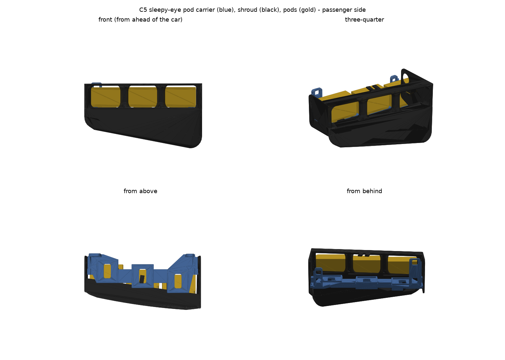
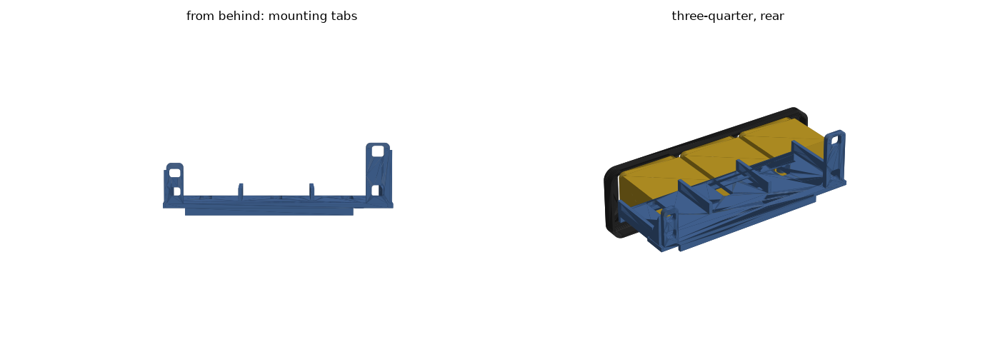

# C5 sleepy-eye pod carrier and bezel (v6)

For a 2000 C5 Corvette with the headlight door stops already fitted, holding three
3.0 × 1.8 in dual-lens LED pods per side. Like the KnightDriveTV kit, each side is one
carrier that bolts to the stock headlight mounting points (the fender-side arm and the
hood-side aiming pad), plus a front bezel with the outside shape of the stock C5 bezel,
which the KnightDriveTV TripLED bezel also copies. The geometry is an original design; see `../notes/c5-sleepy-eye-video.md` for the install video notes it follows.

Assembly diagrams: `diagrams/exploded.png`, `diagrams/front.png`, `diagrams/rear.png`, `diagrams/side.png`.
Step size options (6, 9, 12 and 15 mm) side by side: `diagrams/step_options.png`.
What to measure on the stock bezel and headlight: `diagrams/measure_stock_bezel.png`.

## Measurements used

Taken with a tape on the car. The owner says they're approximate, so every mounting hole
is a short slot, sized snug (6.3 mm) on an M6 bolt so the bolt stays put while you line up.

| | Measurement | Value | Adjustment built in |
|---|---|---|---|
| A | Fender arm, hole 1 to hole 4 | 1.7 in (43.2 mm) | — |
| H | Aiming pad, upper hole to lower hole | 0.8 in measured; 19.0 mm after the test tab showed it a bit wide | — |
| B | Across the car, pad upper hole to arm hole 4 | 8.75 in (222.3 mm) | arm slots ±3.7 mm side to side |
| D | Pad upper hole above arm hole 4 | 0.76 in (19.3 mm) | pad slots ±1.8 mm up and down |
| C | Pad face vs arm face, front to back | unknown | printed spacer washers, 2 / 4 / 6 mm |
| F | Front opening width | 11 in (279.4 mm) | bezel is 269.4 mm, 5 mm clear each side |
| — | Bezel windows | pod face + 2.0 mm left/right and + 1.6 mm top/bottom, centred 0.3 in up for the bracket lift | matches the 1-notch test frame, which fit on the car |
| — | Pods | 3.0 × 1.8 in face, 1.8 in deep, 2.1 in tall with the bracket (maker's drawing) | pod slots: 16 mm forward, 10 mm back |
| — | Pod stud | about 8 mm (5/16 in), in 8.6 mm floor slots | — |
| — | Mounting bolts | M6 × 1.0, 10 mm flange nuts | — |

**Still estimated:**
- How far back the mounting wall sits behind the pod faces (95 mm).
- The pod height relative to the holes (arm hole 4 is 14 mm above the carrier floor).
- The bezel's outside shape and where its top sits against the cover: see "The bezel"
  below. `diagrams/measure_stock_bezel.png` shows the seven numbers that pin these down
  (S1 to S5 on the stock bezel, V and D on the stock headlight with the bezel screwed back on).

The long pod slots and the bezel's slotted tabs take up the fore-aft part of that.

## The curve

Like the KnightDriveTV Gen 2 bracket, the pods follow the curve of the headlight opening
with a staircase, not by turning. All three face straight ahead, and each pocket sits a
little further back than the one beside it:

| Pod | Set back from the hood-side pod |
|---|---|
| Hood side | 0 mm |
| Middle | 12 mm |
| Fender side | 24 mm |

The step is `pod_step` in `generate.py`. It's estimated from photos, so change it if the
pods don't line up with the curve on the car. Steps from 6 to 12 mm pass every check.
At 15 mm the fender-side pod has only 3 mm of wiring room if you slide it all the way back.
At 18 mm it hits the arm's nuts.

- **Carrier:** a stepped beam under the pods with a pocket for each pod's bracket foot. Each
  pod still slides straight fore and aft in its slot (16 mm forward, 10 mm back). Knees at
  each end run back to the arm and pad tabs.
- **Bezel:** one continuous front sweeps back along the same line as the pods (see below).

## The bezel

The bezel copies the outside of the stock C5 bezel (GM 10435411 left, 10435412 right).
The KnightDriveTV TripLED bezel copies it too, then opens the front up for three lights. The
stock bezel is held three ways, and so is this one:

- **Top blade into the headlight cover.** The stock bezel has a flat top that slides in
  under the front edge of the headlight cover. A forked tab on it slides onto a clip on the
  underside of the cover. Corvette Central's how-to describes it: "the tab on the top of
  the bezel that slides onto a clip on the underside of the headlight cover". The
  KnightDriveTV install video shows it too: at 13:02, "Remove bezel by rotating downward and
  forward, while spreading the outer ears". This bezel has the same 30 mm flat top blade
  with a forked tab behind its middle (`blade_depth`, `fork_*` in `generate.py`).
- **Ears (wings) at both ends.** Like the stock and KnightDriveTV ears, they are full
  side walls. Each runs from the front back past the pods to 5 mm in front of the arm and
  the pad, and from the top blade down over the carrier, so the sides are covered too.
  - The stock ears screw to the stock headlight; here each wing takes one M4 × 12 screw
    into a boss on the carrier, in a slot so the bezel can sit further forward.
  - The hood-end wing has a 28 mm hole for reaching the aiming adjuster, like the stock
    ear's. Its position is an estimate (`access_hole_yz`).
- **Two tabs under the front.** These are this design's own, not stock. Each takes an
  M4 × 16 screw up into a boss under the carrier floor.

**Shape:**
- **Front outline:** like the stock bezel, taller at the hood end than at the fender end:
  about 148 mm and 102 mm (`bezel_h_hood`, `bezel_h_fender`). These heights are estimates,
  measured from a head-on frame of the install video (13:00), scaled to the 11 in opening.
  The stock bezel spans the opening when the lights are fully up. At the sleepy stop its
  lower part tucks down behind the body, so there's no gap under the lights.
- **Lower lip:** below the lights, the front slopes down and forward to a rolled lip. The
  lip runs along the bottom, round the bottom corners and up both ends.
- **Open frame, like KnightDriveTV's CAD and scan:** one rounded "mouth" across all
  three pods.
  - **Opening:** 10 mm corners. It flares 4 mm wider at the front edge on the sides and
    bottom, and narrows back to just outside the pods.
  - **Top blade:** stays one clean, continuous line above the opening.
  - **Pods:** sit 14 mm deeper than they have to (`pod_recess`), so the lenses glow from
    back in the shadow. The cavity floor (a shelf just under the pod faces), end walls and
    top blade form one continuous shell.
  - **Posts:** stand in front of each gap between pods, 9 mm wide and 13 mm front to back,
    with trumpet flares into the shelf and the blade. They're trimmed flat behind so they
    never touch the pods.
  - **Lower lip:** bows 6 mm forward in the middle to follow the nose (`front_bow`). It
    isn't built off the body surface: that needs a scan of the car's nose (see below).
  - **Settings:** `post_*`, `pod_recess`, `mouth_*`, `front_bow`, `shelf_t` and
    `end_wall_x` in `generate.py`.

**Before printing the full bezel,** print `stl/fit_test_blade_driver.stl`. It's just the
top blade and fork, 3.7 mm thick. Slide it in under the front of the headlight cover the
way the stock bezel went, and check three things:
- the fork finds the clip,
- the front edge lines up with the cover,
- the ends sit inside the opening.

Then send the numbers on `diagrams/measure_stock_bezel.png`, and the outline and position
get set from them.

**Fit on the car:** it's 269 mm wide in the 279 mm opening. Cycle the door slowly by hand
and check the lip and wings don't touch anything as it goes down into the pocket.

## What changed in v6

- **The top slides into the headlight cover like the stock bezel,** with the same flat top
  blade and forked tab onto the cover's clip. This replaces the foam strip.
- **The front is an open frame like KnightDriveTV's,** with a rounded mouth, the pods set
  14 mm deeper, and trumpet-flared posts between them instead of a tunnel per pod.
- **To follow the body exactly, the face needs a scan of the nose.** A LiDAR iPhone with
  Polycam, exported as STL or OBJ, is enough. Profiles from a contour gauge at 3–4 places
  across the headlight pocket also work.
- **The outside follows the stock and KnightDriveTV shape.** It's taller at the hood end,
  with a rolled lip along the bottom and up both ends, so it goes all the way down.
- **New quick print, `fit_test_blade_*.stl`:** the top blade and fork only, to check the
  slide-in before the big print.
- **New sheet, `diagrams/measure_stock_bezel.png`:** seven numbers off the stock bezel and
  headlight that replace the estimates.
- **The wings are full side walls,** running back past the pods to just in front of the
  arm and the pad, like the stock and KnightDriveTV ears.
- The unused split-plate code is gone from `generate.py`.

## What changed in v5

- **The bezel is restyled after the KnightDriveTV TripLED bezel,** with a swept front,
  tunnels, a rounded lower lip, a top rail and side wings (see above). It replaces the
  boxy wrap.
- **The carrier's two rear posts for the bezel are gone.** Two side bosses for the wing
  screws replace them.
- The mockup now mirrors the pods for the driver side. Before, the stepped pods were
  drawn the wrong way round on that side; the STL files were right.

## What changed in v4

- **The pods are stepped instead of angled.** All three face straight ahead, with each pod
  12 mm behind its neighbour, like the KnightDriveTV Gen 2 bracket.
- **The windows match the 1-notch test frame:** 2.0 mm of gap each side and 1.6 mm top and bottom.
- The mounting tabs and hole spacing are unchanged; the mount test fit.

## What changed in v3

- **The back is two small tabs instead of a full wall.** On the first mount test, the
  plastic around the holes hit parts of the car, so the bolts couldn't line up. Each tab
  now leaves only about 6 mm of plastic around its slots, and the middle is open.
  - The pad tab stops below the square aim adjuster.
  - Nothing near the arm reaches the pivot bolt below hole 4.
- **The bolt holes are snug and the slots shorter.** 6.3 mm for M6 bolts; the spacing
  checked out.
- **The shroud windows are a little bigger:** 1.3 mm of gap around each pod face instead of 0.8.

## Checks

`python3 check.py` runs 37 checks. They all pass:

- The hole spacing matches A, H, B and D.
- Every slot is open, with solid material past its ends.
- A 15 mm flange nut at either end of every slot clears the carrier and the pods.
- The pods clear the carrier across their whole slot travel, and there's always at least
  7 mm behind them for the wiring.
- The pods clear the bezel, which clears the carrier.
- The bezel fits the opening.
- The carrier stays clear of the arm's pivot bolt and the pad's square adjuster, and the
  middle of the back is open.
- The driver part is a true mirror of the passenger part.
- Every STL is one watertight solid lying flat on the bed.

The small-bed split files were dropped: the stepped bezel doesn't split cleanly, and bed size isn't a concern for this build.

## Print order

1. `stl/fit_test_window.stl` (about 15 minutes).
   Three frames, 1-3 notches: 2.0/1.6, 2.3/1.3 and 2.6/1.0 mm of gap (sides/top-bottom).
   The bezel uses the 1-notch size, which fit on the car. Already done.
2. `stl/fit_test_mount_driver.stl` (about 20 minutes, two small flat tabs). Bolt the taller
   tab to the arm (holes 1 and 4) and the shorter one to the aiming pad (both holes).
   The bolts should go through snugly without forcing. Already done: the spacing fit.
3. `stl/fit_test_blade_driver.stl` (about 40 minutes, one flat strip). Slide it in under
   the front of the headlight cover like the stock bezel, and check the fork finds the clip.
4. `stl/carrier_driver.stl` and `stl/bezel_driver.stl`, then the passenger pair. Wait for
   the measurements on `diagrams/measure_stock_bezel.png` before printing the bezel. It
   prints upside down, standing on its flat top blade. Turn supports on for the
   shelf, the lip and the tabs under the front.
5. `stl/spacer_washers.stl`: only if a tab doesn't sit flat against the arm or the pad.

**Material:** ASA or ABS is best; PETG works. Don't use PLA, which softens in a hot engine
bay. Use 4 walls, 40% gyroid infill, and 6 top and bottom layers.

## Hardware (per side)

- 4 × M6 × 1.0 × 20 mm bolts and 10 mm flange nuts (the stock headlight bolts work), with a flat
  washer under each nut so it doesn't dig into the plastic. The nut can't pull through: the slots
  are 6.3 mm wide and an M6 nut is 10 mm across.
- 3 × M6 bolts, washers and nylon lock nuts for the pods, through the floor slots
- 2 × M4 × 16 and 2 × M4 × 12 self-tapping screws for the bezel

## Fitting

1. With the headlight door up, hold the carrier in front of the arm and the pad. Push the bolts
   through from behind the arm (holes 1 and 4) and the pad (both holes), then through the
   carrier's slots, and add the flange nuts on the front. Leave them finger tight.
2. If there's a gap at the arm or the pad, fill it with spacer washers.
3. Bolt the pods on through the floor slots. Slide them forward or back so the lenses sit
   where you want them in the opening, then tighten.
4. Slide the bezel's top blade in under the front of the headlight cover until the fork
   is on the clip, like the stock bezel. Then screw it on: two screws up through the tabs
   under the front and one through each wing. If the lenses sit too far back behind the
   posts, slide the pods forward in their slots to meet it.
5. Cycle the lights slowly by hand with the motor knob and check nothing touches the door
   or the body, then tighten everything.
6. Aim the lights with the stock adjusters.

## Changing the design

Every dimension is a setting at the top of `generate.py`. Change a number, run
`python3 generate.py`, then `python3 check.py`. It needs the `manifold3d`, `trimesh`,
`numpy` and `matplotlib` Python packages.
